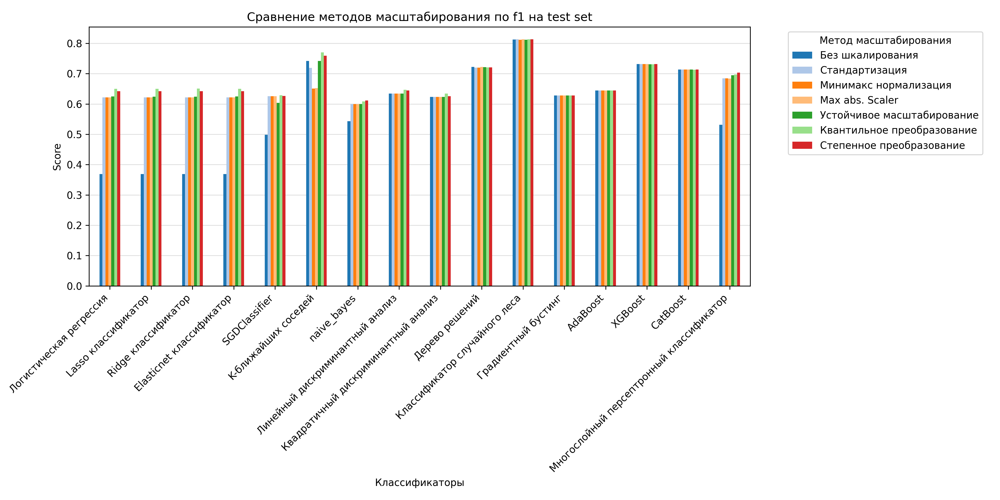
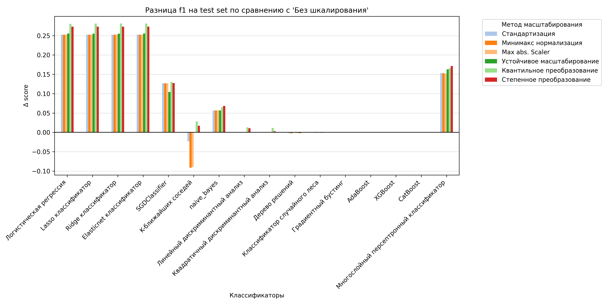
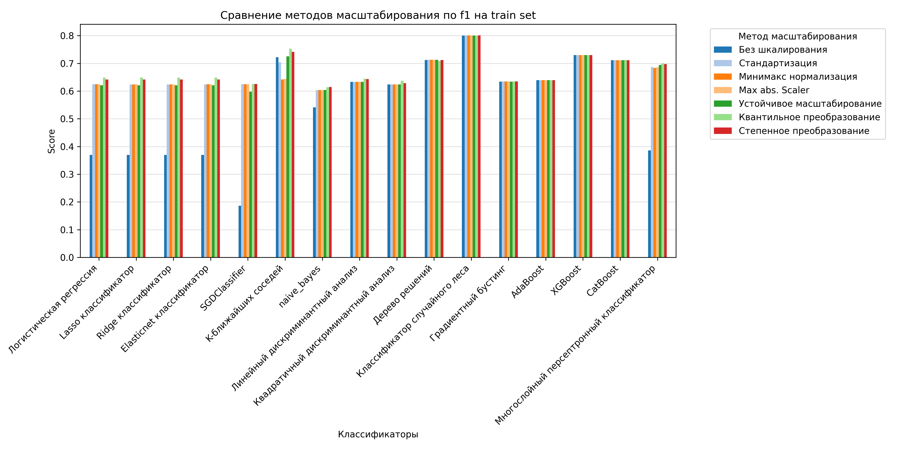
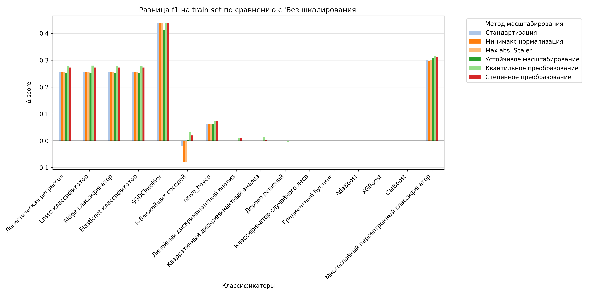
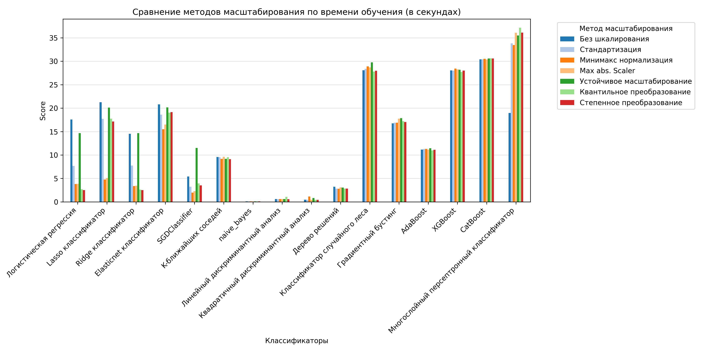
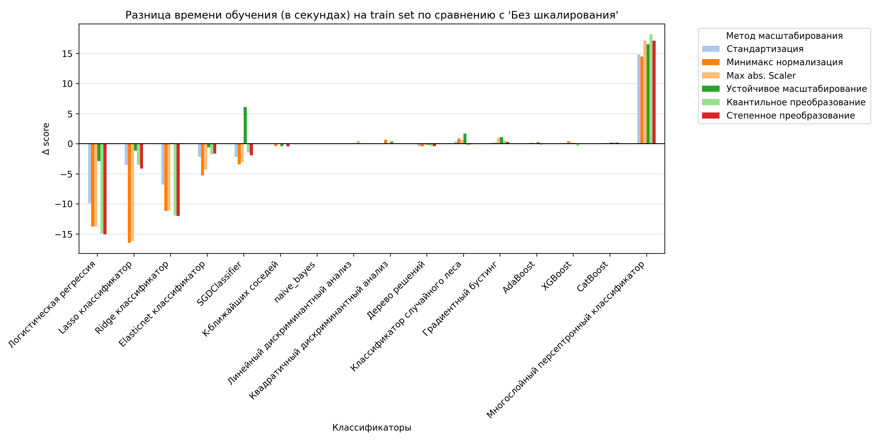

# Проект: Сравнение эффективности различных методов шкалирования данных в задачах классификации

## Описание
Машинное обучение активно используется в самых разных сферах — от банковских сервисов до анализа данных и генерации контента. Однако его эффективность во многом зависит от качества исходных данных. Одним из ключевых шагов является шкалирование признаков, поскольку многие алгоритмы чувствительны к масштабу данных.

**Цель проекта** — сравнить различные методы шкалирования и оценить, как они влияют на качество классификации.

Для этого:
1. рассмотрены основные техники шкалирования,
2. проведены эксперименты с несколькими классификаторами,
3. выполнен сравнительный анализ качества.

Результаты могут помочь при выборе оптимального метода шкалирования для практических задач классификации.

## Данные
Был взят датасет с kaggle [Credit score classification](https://www.kaggle.com/datasets/parisrohan/credit-score-classification). Датасет содержит 100000 объектов данных и 27 признаков.

## Методы масштабирования
* Без шкалирования
* Стандартизация
* Минимакс нормализация
* Max abs. Scaler
* Устойчивое масштабирование
* Квантильное преобразование
* Степенное преобразование Йео-Джонсона

## Модели классификации
*Линейные модели*
* Логистическая регрессия
* Lasso классификатор  
* Ridge классификатор
* Elasticnet классификатор
* SGDClassifier

*Метрические методы*
* K-ближайших соседей

*Вероятностные*
* naive_bayes

*Дискриминантный анализ*
* Линейный дискриминантный анализ
* Квадратичный дискриминантный анализ

*Модели, основанные на деревьях*
* Дерево решений
* Классификатор случайного леса
* Градиентный бустинг
* AdaBoost
* XGBoost
* CatBoost

*MLP*
* Многослойный персептронный классификатор

## Метрики оценки
Была выбрана **метрика f1**, чтобы в равной степени учитывать precision и recall

## Результаты
Ниже показаны сравнительные графики:

### f1 на test set
Абсолютные значения:

Прирост относительно метода 'Без шкалирования':

### f1 на train set (cross validated)
Абсолютные значения:

Прирост относительно метода 'Без шкалирования':

### train time (в секундах) на train set (cross validated)
Абсолютные значения:

Прирост относительно метода 'Без шкалирования':

### Основные наблюдения
* Деревья решений и ансамблевые методы практически не зависят от шкалирования.
* Линейные модели (например, SGD) значительно выигрывают при использовании шкалирования.
* Отсутствие шкалирования не улучшает качество работы моделей (за исключением K-ближайших соседей).

## Выводы
Методы шкалирования чаще всего либо улучшают, либо не ухудшают качество модели, поэтому их использование можно считать оправданным. В то же время остаётся потребность в более фундаментальных исследованиях, которые охватывали бы широкий спектр алгоритмов и техник шкалирования.
